# Manual Técnico y de Usuario

## Manual Técnico
### Árbol N-Ario
El manual técnico muestra en detalle la implementacion de cada uno de los métodos más importantes en este programa. Empezamos explicando la implementación del árbol n-ario:

Un árbol es una estructura de datos que se compone de nodos interconectados. El nodo superior se llama raíz y los nodos inferiores se llaman nodos hijos. Cada nodo puede tener cero o más nodos hijos, y los nodos que no tienen hijos se llaman nodos hoja. La conexión entre los nodos se llama arista o borde, y el número máximo de hijos que puede tener un nodo se llama grado del árbol. Si cada nodo tiene un grado máximo de 2, entonces el árbol se llama árbol binario.

```
class TreeNode {
  constructor(value) {
    this.value = value;
    this.children = [];
  }

  addChild(node) {
    this.children.push(node);
  }
}

class NaryTree {
  constructor(root) {
    this.root = root;
  }

  traverseBFS() {
    let result = [];
    let queue = [this.root];
    while (queue.length > 0) {
      let currentNode = queue.shift();
      result.push(currentNode.value);
      for (let i = 0; i < currentNode.children.length; i++) {
        queue.push(currentNode.children[i]);
      }
    }
    return result;
  }
}

```
Este árbol es un ejemplo de un árbol de búsqueda binario. Cada nodo en el árbol tiene un valor numérico, y se ordenan de tal manera que los nodos con valores menores se encuentran a la izquierda de un nodo, y los nodos con valores mayores se encuentran a la derecha.

Cuando se inserta un nuevo nodo en el árbol, se compara su valor con el valor del nodo actual. Si el valor es menor, se inserta en la subárbol izquierda; si es mayor, se inserta en la subárbol derecha. Este proceso se repite hasta encontrar un lugar vacío en el que se pueda insertar el nuevo nodo.


Aquí hay un ejemplo de un árbol de búsqueda binario que contiene los valores 10, 5, 15, 3, 7, 13 y 17:

```     
        10
       /  \
      5    15
     / \   / \
    3   7 13 17
```
### Carga de JSON
Tenemos un objeto JSON con un array alumnos que contiene tres objetos, cada uno representando a un estudiante. Podemos iterar sobre el array utilizando un bucle for o el método forEach().

```
jsonData.alumnos.forEach(alumno => {
  console.log(alumno.nombre + " - " + alumno.carnet);
});
```
### Árbol AVL
Ahora veremos la impolementación del árbol AVL el cual empezamos por ver el nodo que se utilizó para rellenar el árbol
```
class Node {
    constructor(value, estudiante, contadorGraphviz) {
        this.value = value;
        this.left = null;
        this.right = null;
        this.height = 1;
        this.estudiante = estudiante;
        this.contadorGraphviz = contadorGraphviz;
    }
    getCodigoInterno() {
        let etiqueta;
        etiqueta = `nodo${this.contadorGraphviz} [ label = " ${this.value} \n ${this.estudiante.nombre} \n Altura: ${this.height} "];\n`;
        if (this.left != null) {
            etiqueta = etiqueta + this.left.getCodigoInterno()
                + "nodo" + this.contadorGraphviz + "->nodo" + this.left.contadorGraphviz + "\n";
        }
        if (this.right != null) {
            etiqueta = etiqueta + this.right.getCodigoInterno()
                + "nodo" + this.contadorGraphviz + "->nodo" + this.right.contadorGraphviz + "\n";
        }
        return etiqueta;
    }
}
```
Tambien podemos observar que se implementó una funcion llamada getCodigoInterno() la cual se utiliza para poder graficar el árbol, iterandolo desde la raíz hacia cada nodo hijo de forma recursiva.

### Carga de JSON
Ahora vemos esta función se utiliza para realizar una rotación hacia la derecha en un árbol AVL. La rotación hacia la derecha se utiliza para equilibrar un árbol AVL que ha sido desequilibrado por un subárbol izquierdo pesado.

```
rotateRight(node) {
    let left = node.left;
    let rightOfLeft = left.right;
    left.right = node;
    node.left = rightOfLeft;
    node.height = 1 + Math.max(this.height(node.left), this.height(node.right));
    left.height = 1 + Math.max(this.height(left.left), this.height(left.right));
    return left;
  }
```
Aquí, el cálculo de altura se realiza utilizando la función "height" de la clase AVL que es responsable de calcular la altura del nodo y puede ser diferente para diferentes implementaciones.

```
  getHeight(node) {
    if (node === null) {
      return 0;
    }
    return node.height;
  }
```
Esta función "getBalanceFactor" se utiliza para calcular el factor de equilibrio de un nodo en un árbol AVL. El factor de equilibrio es la diferencia entre las alturas del subárbol izquierdo y derecho de un nodo.

La función toma un nodo como argumento y realiza los siguientes pasos:

Verifica si el nodo es nulo (es decir, si el árbol está vacío) y, en ese caso, devuelve 0 porque no hay ningún subárbol izquierdo o derecho para calcular la diferencia de alturas.
Si el nodo no es nulo, devuelve la diferencia entre la altura del subárbol izquierdo y la altura del subárbol derecho del nodo. Esto se calcula restando la altura del hijo derecho del nodo de la altura del hijo izquierdo del nodo.


```
  getBalanceFactor(node) {
    if (node === null) {
      return 0;
    }
    return this.getHeight(node.left) - this.getHeight(node.right);
  }
```
La lista circular doble es una estructura de datos en la que cada elemento está conectado tanto con el elemento anterior como con el siguiente en la lista. Además, el último elemento de la lista está conectado con el primer elemento, formando así un ciclo continuo. En este caso se utilizó para guardar la bitácora de los usuarios y en donde se almacenaron los archivos

```
class Node {
  constructor(value) {
    this.value = value;
    this.next = null;
  }
}

class CircularLinkedList {
  constructor() {
    this.head = null;
    this.tail = null;
    this.length = 0;
  }

  // Agrega un nodo al final de la lista
  append(value) {
    const newNode = new Node(value);

    if (this.head === null) {
      this.head = newNode;
      this.tail = newNode;
      newNode.next = this.head;
    } else {
      this.tail.next = newNode;
      this.tail = newNode;
      this.tail.next = this.head;
    }

    this.length++;
  }
```
La función append() agrega un nodo a la lista a la cabeza de esta.

### Nodo Estudiante

En esta clase se puede observar el objeto Estudiante el cual es el que se usa para poder almacenar todas las estructuras como la información de cada usuario y el árbol n-ario y la lista circular.

```
export default class Estudiante {
    constructor(nombre, carne, password, carpetaRaiz) {
        this.nombre = nombre;
        this.carne = carne;
        this.password = password;
        this.carpetaRaiz = carpetaRaiz;
        this.nTree = new Tree('/');
        this.bitacora = new CircularLinkedList();
        this.archivos = new CircularLinkedList();
    }
}
```

## Manual de Usuario
### Pantalla de inicio
En la pantalla de inicio podremos iniciar sesión con nuestro usuario aunque al principio el único usuario agregado es el de administrador así que tendremos que iniciar sesión como administrador y cargar los usuarios desde este menú.

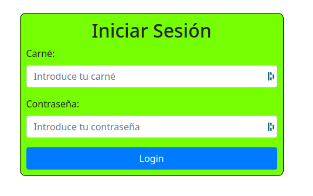

### Pantalla del administrador
En el menú de administrador tenemos otras opciones las cuales nos ayudaran a cargar el archivo JSON con todos los usuarios:

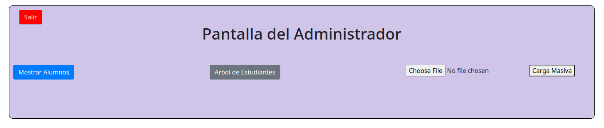

En la parte derecha podemos presionar un boton para elegir el archivo JSON

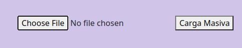

Una vez presionado nos saldrá una ventana para seleccionar el archivo.

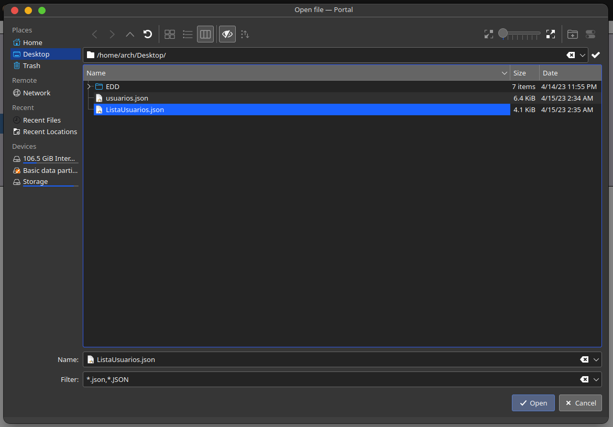

Luego tenemos la opción de mostrar el árbol AVL generado por graphviz en el boton "Arbol de estudiantes".

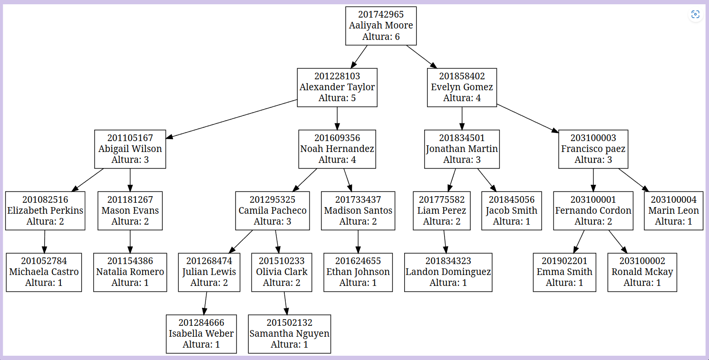

Luego tenemos el boton de "Mostrar Alumnos" que nos muestra los tipos de ordenamientos que cuenta el árbol y un boton para seleccionar cada uno de ellos.

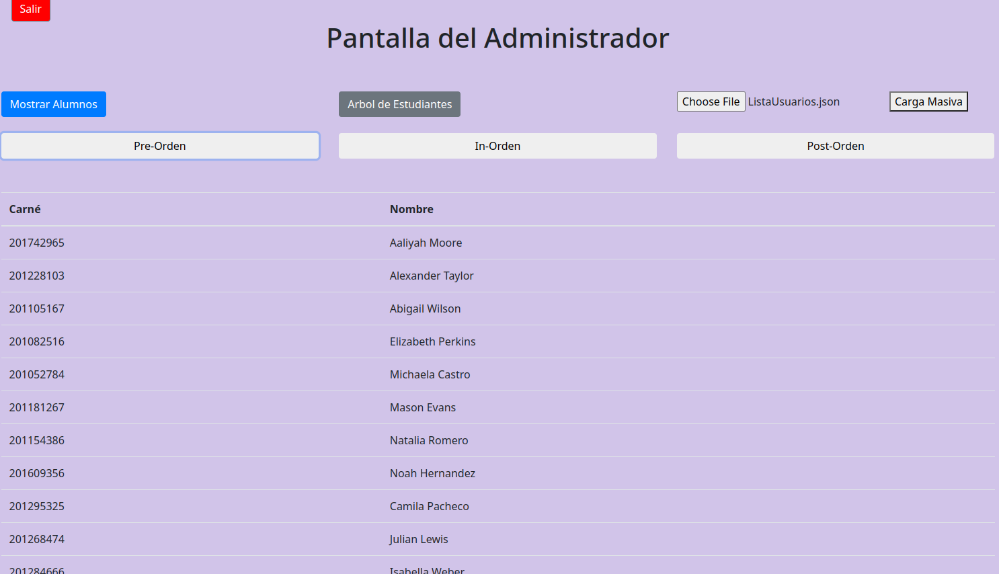

Cada menú tendrá un boton de salir a la izquierda superior de la ventana.

### Pantalla de Usuario

En esta menú podremos ver los diferentes botones para cada una de las funciones como por ejemplo el de crear carpeta que esta de color azúl y nos lanza un mensaje de que introduzcamos el nombre de la carpeta que deseamos crear.


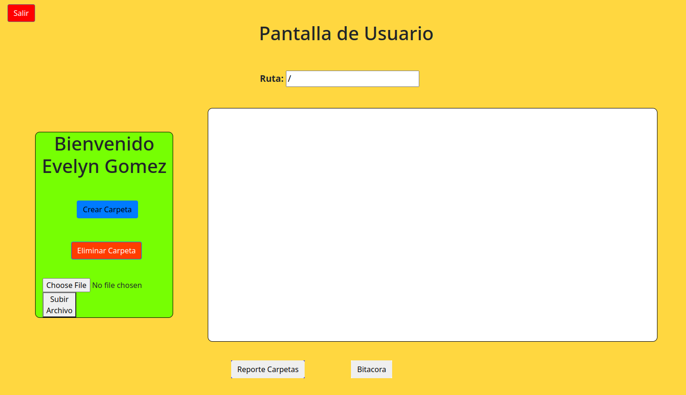

El menú de las carpetas esta compuesto por botones los cuales crean o eliminan las carpetas y archivos del sistema.

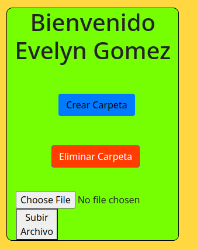

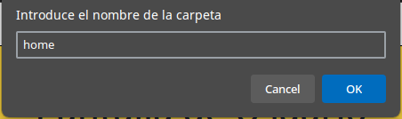


Al crear varias carpetas se irá actualizando la vista de carpetas y nos mostrará las carpetas que hay en la ruta seleccionada.

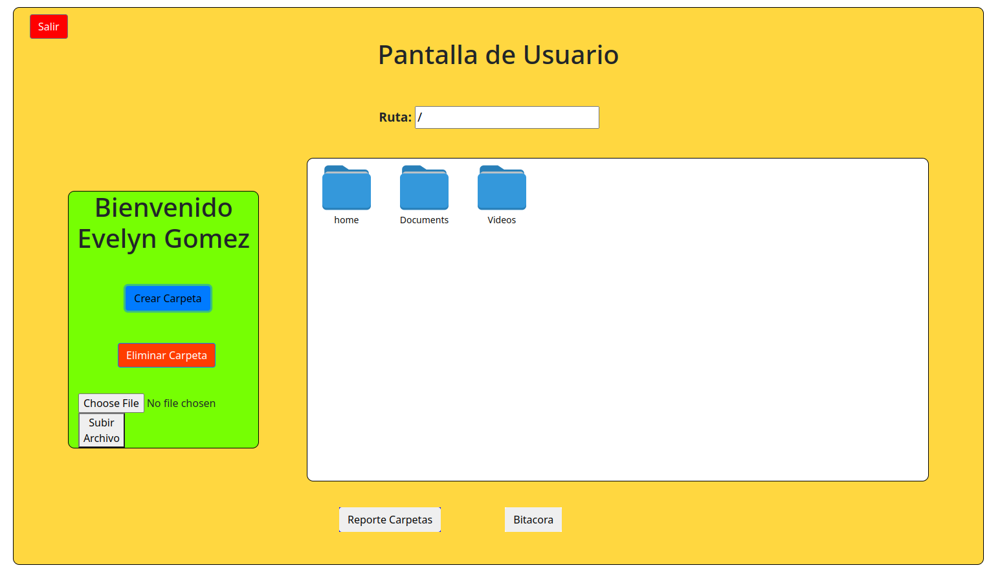

El reporte de carpetas nos muestra el gráfico hecho en graphviz de el sistema de archivos.

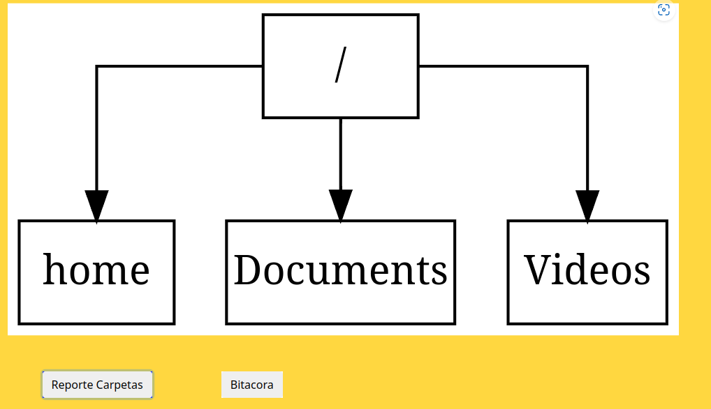

La bitácora nos muestra el log de todas las acciones que hace el usuario.

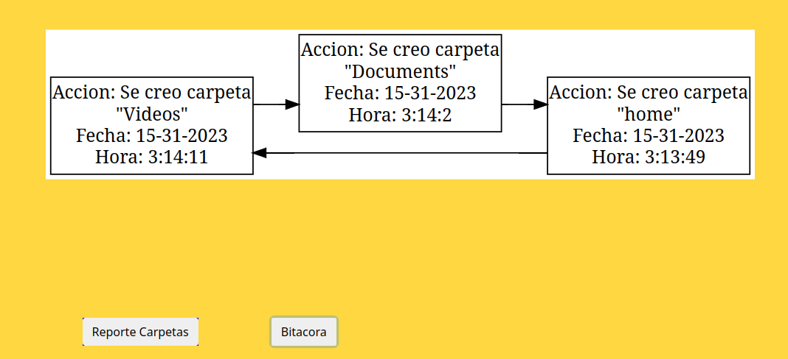
