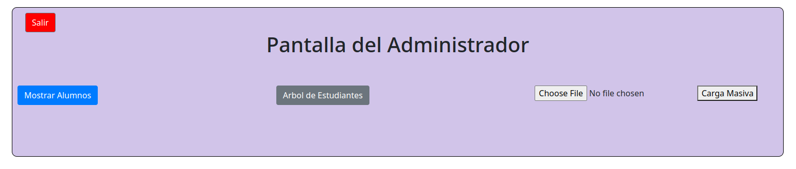
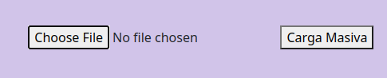

# Manual de Usuario
### Pantalla de inicio
En la pantalla de inicio podremos iniciar sesión con nuestro usuario aunque al principio el único usuario agregado es el de administrador así que tendremos que iniciar sesión como administrador y cargar los usuarios desde este menú.

### Pantalla del administrador
En el menú de administrador tenemos otras opciones las cuales nos ayudaran a cargar el archivo JSON con todos los usuarios:

En la parte derecha podemos presionar un boton para elegir el archivo JSON

Una vez presionado nos saldrá una ventana para seleccionar el archivo.

Luego tenemos la opción de mostrar el árbol AVL generado por graphviz en el boton "Arbol de estudiantes".

Luego tenemos el boton de "Mostrar Alumnos" que nos muestra los tipos de ordenamientos que cuenta el árbol y un boton para seleccionar cada uno de ellos.

Cada menú tendrá un boton de salir a la izquierda superior de la ventana.

### Pantalla de Usuario

En esta menú podremos ver los diferentes botones para cada una de las funciones como por ejemplo el de crear carpeta que esta de color azúl y nos lanza un mensaje de que introduzcamos el nombre de la carpeta que deseamos crear.

El menú de las carpetas esta compuesto por botones los cuales crean o eliminan las carpetas y archivos del sistema.

Al crear varias carpetas se irá actualizando la vista de carpetas y nos mostrará las carpetas que hay en la ruta seleccionada.

El reporte de carpetas nos muestra el gráfico hecho en graphviz de el sistema de archivos.

La bitácora nos muestra el log de todas las acciones que hace el usuario.

